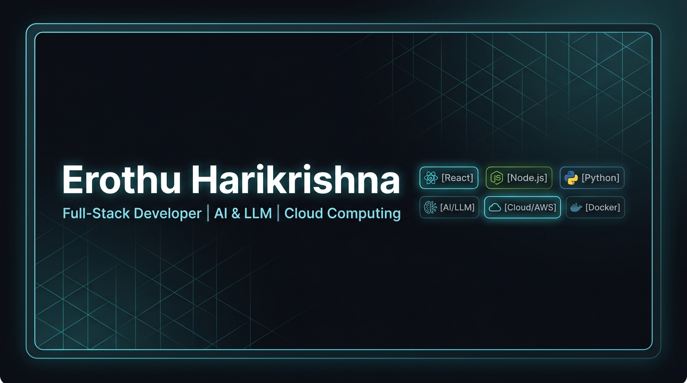

# Erothu Harikrishna — Developer Portfolio

A modern, recruiter-focused developer portfolio website built for **Erothu Harikrishna**, positioning him as a Full-Stack Web Developer with deep interest in AI/LLMs and Cloud Computing.



## ⚡ Tech Stack & Architecture

- **Framework**: React 19 + TypeScript + Vite
- **Styling**: Tailwind CSS v4 with custom design tokens & glassmorphism
- **Icons**: Lucide React + custom SVG brand glyphs (GitHub, LinkedIn, LeetCode)
- **Theme**: Dark Mode by default with persistent Light/Dark toggle (`ThemeContext`)
- **Animations**: Lightweight 60 FPS HTML5 Canvas particle background + CSS micro-interactions
- **Typography**: Plus Jakarta Sans, Inter, JetBrains Mono

---

## 🚀 Features & Sections

1. **Sticky Glassmorphic Navbar**: Section scroll-spy, active navigation state, Light/Dark mode toggle, mobile navigation drawer, and prominent Resume CTA.
2. **Hero Section**:
   - Title: *Erothu Harikrishna*
   - Subtitle: *Full-Stack Developer | AI & LLM Enthusiast | Cloud Computing*
   - Recruiter badge: Open to Software Engineering & Full-Stack roles (2026–2027)
   - Interactive developer telemetry / code window (`stack.json` & `terminal` tabs)
   - Direct CTAs: View Projects, Download Resume, GitHub, LinkedIn
3. **About Section**: Concise narrative highlighting full-stack engineering, AI/LLM models, cloud systems, DSA problem-solving, and hackathons.
4. **Skills Matrix**: Categorized tech badges (Programming, Frontend, Backend, AI/ML/LLM, Databases, Cloud, Tools) with category filtering tabs. (No unrealistic percentage bars).
5. **Featured Projects**:
   - **CareerSync**: AI-powered career development and roadmap platform ([Live Demo](https://careersync-landing-oldo.onrender.com/))
   - **AgriMithra**: Intelligent farm and telemetry web platform ([GitHub](https://github.com/HarishBonu0/Agri_Mithra) | [Live Demo](https://agri-mytra.vercel.app/))
   - **AI-Driven PFZ Prediction**: Final-year oceanographic satellite machine learning system for Potential Fishing Zones ([GitHub](https://github.com/harikrishnaerothu34/ai-driven-pfz-prediction.git))
   - **ClaimFlow AI**: Automated insurance claim processing and OCR workflow engine ([GitHub](https://github.com/HarishBonu0/claimflow-ai))
6. **Achievements**:
   - 🏆 **1st Place – Student Innovation Category**: NSRIT Hackathon (Team AspireX)
   - 🥈 **Runner-Up**: Andhra University Hackathon
   - Finalist & Participant: Centurion University, AITAM, GMRIT Hackathons
7. **Certifications**:
   - AWS Cloud Foundations (AWS)
   - NPTEL Certification (NPTEL / IIT)
   - Applied Machine Learning (L&T EduTech)
   - Language Model Architecture (L&T EduTech)
8. **DSA & Coding Profile**:
   - Verified [LeetCode Profile](https://leetcode.com/u/harikrishnaerothu34/)
   - Difficulty breakdown (Easy, Medium, Hard) and key algorithmic topic coverage.
9. **Education**: B.Tech Information Technology at GMR Institute of Technology (2023–2027).
10. **Technical Experience**: Realistic experience covering competitive hackathon lead roles, capstone ML research, and customizable internship slot.
11. **Interactive Resume Modal & Downloads**: In-browser ATS resume preview with print shortcut and PDF download link.
12. **Contact Section**: One-click email copy (`harikrishnaerothu34@gmail.com`), GitHub, LinkedIn, and responsive contact form with input validation.

---

## 🛠️ Local Development & Build

### Install Dependencies
```bash
npm install
```

### Run Local Development Server
```bash
npm run dev
```
Open [http://localhost:5173](http://localhost:5173) in your browser.

### Build for Production
```bash
npm run build
```
The optimized bundle will be created in the `dist/` directory.

### Preview Production Build
```bash
npm run preview
```

---

## 📁 Project Structure

```
portfolio/
├── public/
│   ├── projects/          # High-resolution project UI previews
│   │   ├── careersync.jpg
│   │   ├── agrimithra.jpg
│   │   ├── pfz-prediction.jpg
│   │   └── claimflow.jpg
│   ├── og-image.jpg       # Open Graph social share banner
│   └── Erothu_Harikrishna_Resume.pdf
├── src/
│   ├── components/
│   │   ├── Navbar.tsx
│   │   ├── Hero.tsx
│   │   ├── TechBackground.tsx
│   │   ├── About.tsx
│   │   ├── Skills.tsx
│   │   ├── Projects.tsx
│   │   ├── ProjectCard.tsx
│   │   ├── Achievements.tsx
│   │   ├── Certifications.tsx
│   │   ├── CodingProfiles.tsx
│   │   ├── Education.tsx
│   │   ├── Experience.tsx
│   │   ├── ResumeSection.tsx
│   │   ├── ResumeModal.tsx
│   │   ├── Contact.tsx
│   │   ├── Footer.tsx
│   │   ├── ThemeToggle.tsx
│   │   └── Icons.tsx
│   ├── context/
│   │   └── ThemeContext.tsx
│   ├── data/
│   │   └── portfolioData.ts  # Centralized, strictly factual content source
│   ├── types/
│   │   └── index.ts
│   ├── App.tsx
│   ├── index.css
│   └── main.tsx
└── index.html
```
